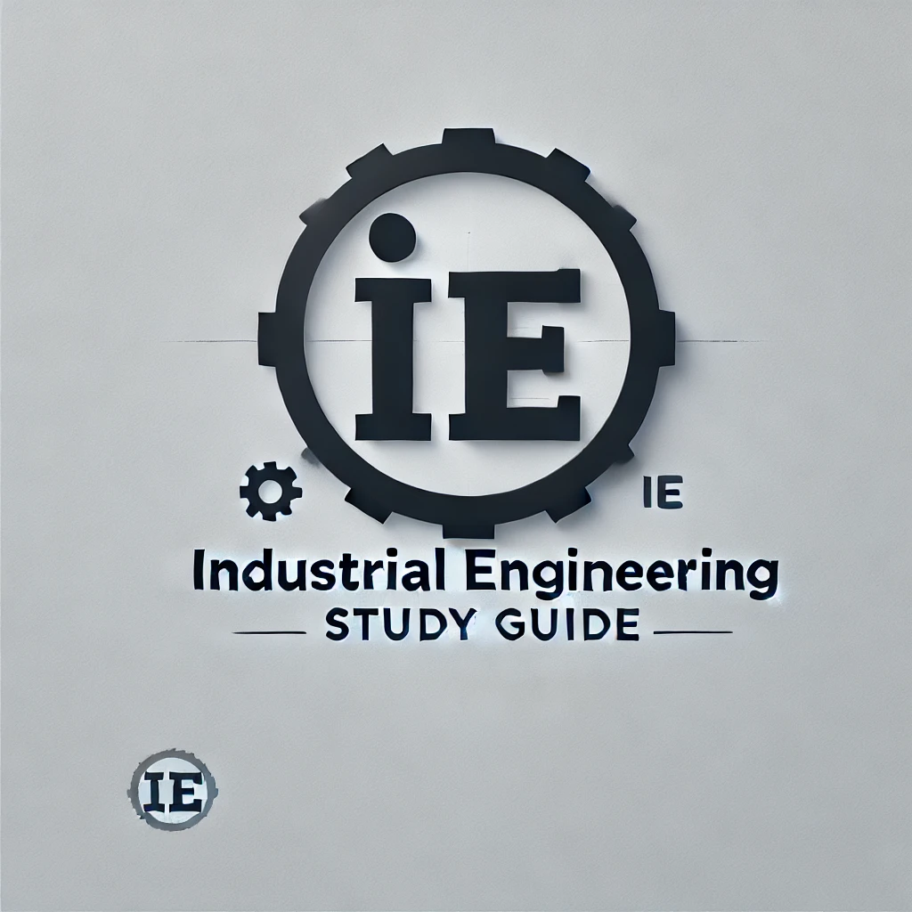

<figure markdown>
  { width="300" }
</figure>

# 前言
这是一本写给南大IE学子的学习指南，同时穿插我对IE学习的思考，如果这本书能对你们的大学学习生涯有哪怕一丝一毫的帮助，都是对我极大的鼓励和慰藉。

本书内容包括：

- IE是什么。

- 学习本学科要用到的基本工具：如ChatGPT、git、markdown、latex等等。

- **南大IE所有课程资料汇总**：把NJUIE所有课程资源分门别类进行汇总，包含学习内容、任课老师、课程教材、课程学习建议
、往年卷、补充资料等，供大家学习参考。

- 经典书籍推荐：推荐IE领域的必看好书。

<!-- - **仅供参考的IE学习规划**：我将结合自身对IE的理解，给出我认为最合理的IE学习路径。 -->

## 为什么写这本书

在大学中，学习资料似乎很少是开源的。学习《微积分》时，要翻遍新生资源群，才能找到一本学长遗留的、老旧且错误颇多的习题答案；学习《学术英语》时，不好意思在2000人的咨询群中提问，只能在先前学长/姐中留下的只言片语中，推测学习内容。直到我下笔的今天，仍有同学在校园集市中咨询某某课程的讲授情况、复习资料、老师评价……似乎学习资源的传递在不同年级之间是间断的，大一的学弟学妹们没法获得大二的我的经验与资源，而我也会在学习时走入认知的无人区。大部分南大学子都是乐于分享自己的学习经验和资源的，而最大的问题便在于没有合适的渠道与信息的汇总。如此，我们一届届南大学子都不断踏上前辈踩过的坑，在原子化的学习中迷失、沉淀，被迫接受这一切……

大一的暑假，我又偶然看到了[浙大图灵班学习指南](https://zju-turing.github.io/TuringCourses/readings/)这个网站。这是浙大图灵班同学为自身课程量身定制的开源网站，分门别类包含所有课程的学习内容、任课教师、参考笔记等资源，所有人都可以对资源质量做出评论，且一直在更新中。我意识到，大学的学习不一定是原子化的，一个班级、几届同学的力量就足以为自己和后来的同学留下完备的学习资源。

南大也有自己类似的资源共享网站，如[NJU-CS 课程分享计划](https://github.com/zhangyikaii/NJUCS-Course-Material)、[南京大学课程复习资料](https://github.com/idealclover/NJU-Review-Materials)、[NJUAI-Notes](https://github.com/OrangeX4/NJUAI-Notes)。这些资料给大一的我无比大的帮助，但都不再更新，且课程覆盖面较窄。

这本书的目的就是要建立南大IE**自己的学习指南**。每个人都可以把自己的学习资源与方法分享，再由专人分门别类详细汇总，让知识与经验平等且高效地惠及每一个人。
